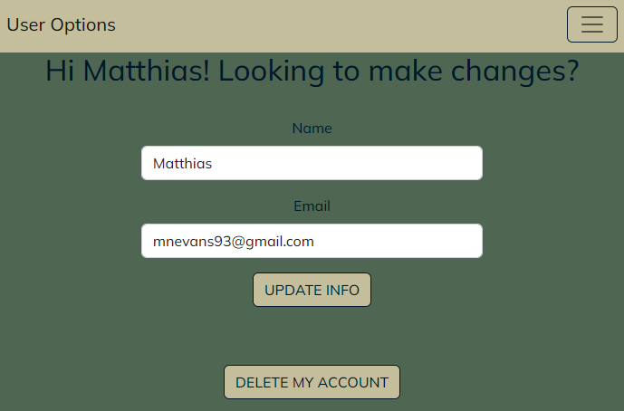

# BudgIt - An app for tracking your expenses!

## <u>Introduction</u>
BudgIt is a personal project of mine, designed to replace budget spreadsheets I've created with a simple web app that allows you to track transactions on your various accounts, whether they are bank accounts or credit cards, to help provide short and long-term overviews of your financials. BudgIt is not set up to connect to your bank or credit card company directly, and as such, it will not pull data directly from those accounts.

## <u>Technologies Used</u>
<ul>
    <li>MongoDB / Mongoose</li>
    <li>Express</li>
    <li>React</li>
    <li>Node.js</li>
</ul>

## <u>Planning</u>
<a href='https://trello.com/b/O4HcFuG9/budgit-app'>Trello Board Link</a>

<a href='https://lucid.app/lucidchart/fca1836a-5164-474a-a950-7c61913f8e83/edit?viewport_loc=-329%2C-148%2C2219%2C1065%2C0_0&invitationId=inv_af664043-3716-4c77-8c28-2754a3f528b8'>ERD Link</a>

## <u>App Overview</u>
Welcome Page

Upon loading the app, you are greeted with a simple welcome page where you can sign up or login to an existing account.

Dashboard

On the dashboard, all your accounts are displayed within a simple carousel that allows you to view current account balances with a form to create a new transaction on any of those accounts.

Individual Account Page

Each account has a more detailed Account page which lists your transaction history and also gives you the option to change the account nickname or delete the account entirely.

User Options Page

If a user would like to update their name or email address, they can do so from this page. They can also delete their account entirely which will wipe their data from the database and return them to the Welcome page.

## <u>Future Improvements</u>
<ul>
    <li>Add ability for users to update their password</li>
    <li>Add more sorting options for transactions</li>
    <li>Add pagination for transaction tables</li>
    <li>Add more ways to view the data besides tables</li>
</ul>
